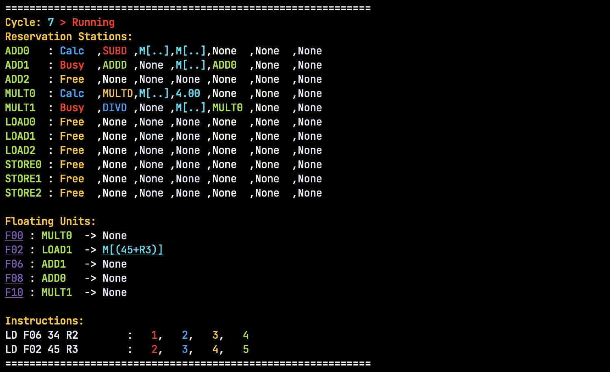
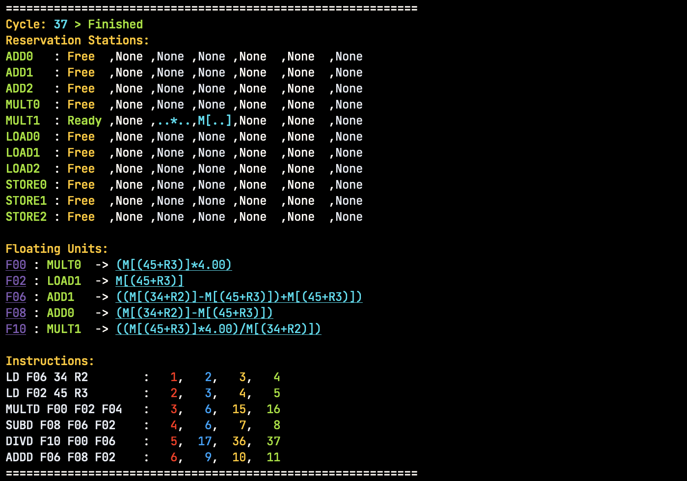

# Tomasulo Simulator

This is a Tomasulo simulator written in Rust for the course Computer Architecture.

Two Demo programs are tested in the simulator, which are in the `main.rs` file.

## Usage

Use `s.parse::<Instruction>()` to parse a string to an instruction.

Use following code to run the simulator:

```rust
let mut executer = executer::Executer::new();
executer.add_insts(insts);
executer.run();
```

## Note

This is only a **course project**, so it is not well tested. If you find any bugs, please open an issue.

## Demo



